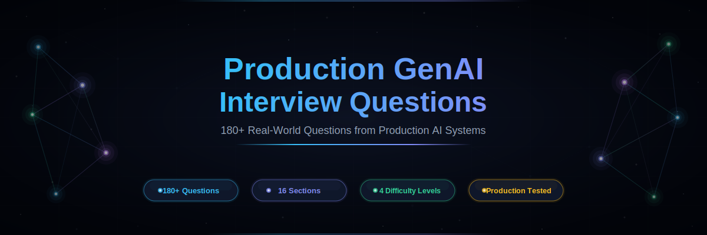
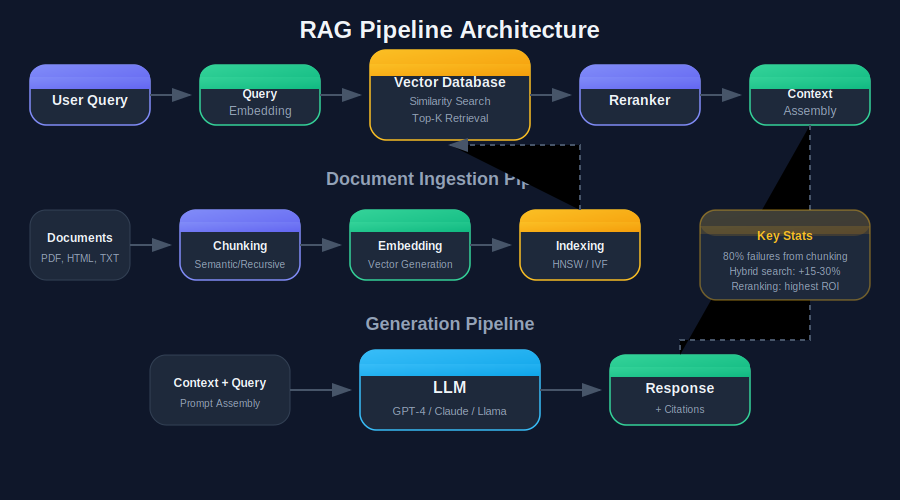
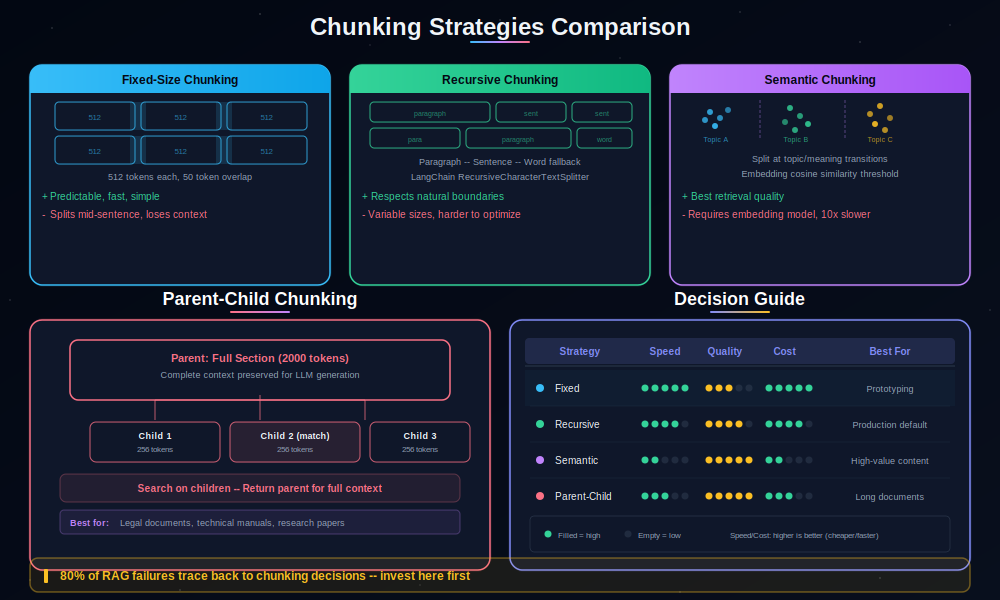
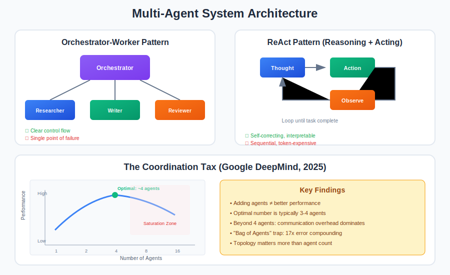

<!-- Header Banner -->

 

<!-- Badges -->

 

**Real-world questions based on production deployments, not textbook theory.**
 
*Based on production AI systems deployed across MENA enterprises*

 

---

## Difficulty Levels

| | Level | Target | Description |
|:---:|:---|:---|:---|
| 🟢 | **Fresh** | Entry-level | Core concepts, fundamentals, "what is X" questions |
| 🟡 | **Intermediate** | 1-3 years | Implementation details, trade-offs, "how would you" questions |
| 🔴 | **Advanced** | 3-5 years | Production exposure, debugging, architecture decisions |
| ⚫ | **Expert** | 5+ years | System design, scale challenges, strategic decisions |

---

## Sections

<table>
<tr>
<td align="center" width="25%">
 
<b>10 Questions</b> · Architecture, Self-RAG, Agentic RAG, debugging 
🟢🟡🔴⚫
</td>
<td align="center" width="25%">
 
<b>7 Questions</b> · Fixed, recursive, semantic, parent-child 
🟢🟡🔴⚫
</td>
<td align="center" width="25%">
 
<b>8 Questions</b> · HNSW, IVF, PQ, multi-tenancy, bias 
🟢🟡🔴⚫
</td>
<td align="center" width="25%">
 
<b>6 Questions</b> · BM25, RRF, reranking, cross-encoders 
🟡🔴⚫
</td>
</tr>
<tr>
<td align="center" width="25%">
 
<b>6 Questions</b> · Cache strategies, invalidation, cost savings 
🟢🟡🔴⚫
</td>
<td align="center" width="25%">
 
<b>9 Questions</b> · Orchestrator, ReAct, coordination tax 
🟢🟡🔴⚫
</td>
<td align="center" width="25%">
 
<b>6 Questions</b> · Tool use, schema design, error handling 
🟢🟡🔴⚫
</td>
<td align="center" width="25%">
 
<b>8 Questions</b> · Tokenization, dialects, embeddings, RTL 
🟢🟡🔴⚫
</td>
</tr>
<tr>
<td align="center" width="25%">
 
<b>8 Questions</b> · Quantization, vLLM, batching, GPU memory 
🟢🟡🔴⚫
</td>
<td align="center" width="25%">
 
<b>6 Questions</b> · LoRA, QLoRA, data quality, evaluation 
🟢🟡🔴⚫
</td>
<td align="center" width="25%">
 
<b>6 Questions</b> · RAGAS, LLM-as-Judge, golden datasets 
🟢🟡🔴⚫
</td>
<td align="center" width="25%">
 
<b>6 Questions</b> · Prompt injection, OWASP, PII, defense layers 
🟢🟡🔴⚫
</td>
</tr>
<tr>
<td align="center" width="25%">
 
<b>5 Questions</b> · Token costs, caching, model routing 
🟡🔴⚫
</td>
<td align="center" width="25%">
 
<b>4 Questions</b> · Tracing, metrics, alerting, dashboards 
🟡🔴⚫
</td>
<td align="center" width="25%">
 
<b>5 Questions</b> · Hallucinations, CoT failures, edge cases 
🟡🔴⚫
</td>
<td align="center" width="25%">
 
<b>5 Questions</b> · End-to-end architectures, scaling, trade-offs 
⚫
</td>
</tr>
</table>

---

## Architecture Diagrams

Each section includes detailed architecture diagrams. Here's a preview:

<table>
<tr>
<td align="center" width="33%">
 
<b>RAG Pipeline Architecture</b>
</td>
<td align="center" width="33%">
 
<b>Chunking Strategies</b>
</td>
<td align="center" width="33%">
 
<b>Hybrid Search Pipeline</b>
</td>
</tr>
<tr>
<td align="center" width="33%">
 
<b>Multi-Agent Systems</b>
</td>
<td align="center" width="33%">
 
<b>Semantic Caching</b>
</td>
<td align="center" width="33%">
 
<b>Vector DB Architecture</b>
</td>
</tr>
</table>

---

## How to Use This Guide

<table>
<tr>
<td width="50%">

### For Interview Prep
1. Start with sections matching your experience level
2. Read the question first, try to answer it yourself
3. Compare with the expected answer
4. Pay attention to **Red Flags** — interviewers watch for these
5. Practice explaining concepts out loud

</td>
<td width="50%">

### For Team Training
1. Use as a structured knowledge assessment
2. Assign sections based on team roles
3. Discuss answers in group sessions
4. Build internal knowledge base from answers
5. Track improvement over time

</td>
</tr>
</table>

---

## Quick Reference

> **Key Stats from Production Deployments**

| Insight | Source |
|:---|:---|
| 90% of agentic RAG projects failed in production in 2024 | [RAG Systems](./sections/01-rag-systems.md) |
| Semantic chunking improved faithfulness from 0.47 to 0.79 | [Chunking](./sections/02-chunking-strategies.md) |
| 1B vectors at 1024 dims = ~4TB storage | [Vector DBs](./sections/03-embeddings-vector-databases.md) |
| Hybrid search: +15-30% precision over vector-only | [Hybrid Search](./sections/04-hybrid-search-reranking.md) |
| Semantic caching: $52K → $4.8K monthly (90% reduction) | [Caching](./sections/05-semantic-caching.md) |
| Optimal multi-agent count is typically 3-4 agents | [Multi-Agent](./sections/06-multi-agent-systems.md) |
| Arabic tokenizers use 3-5x more tokens than English | [Arabic NLP](./sections/08-arabic-nlp-challenges.md) |

---

## Bonus Sections

<table>
<tr>
<td align="center" width="50%">
<a href="./sections/red-flags.md">

### 🚩 Red Flags
Common mistakes that reveal shallow understanding during interviews. Categorized by topic: RAG, Multi-Agent, Deployment, Evaluation, Security.

</a>
</td>
<td align="center" width="50%">
<a href="./sections/resources.md">

### 📚 Resources
Curated papers, frameworks, and evaluation tools. Including landmark papers on RAG, Self-RAG, and the Google DeepMind agent scaling study.

</a>
</td>
</tr>
</table>

---

## Contributing

Contributions welcome! Please:

1. **Open an issue** for discussion first
2. **Submit a PR** with new questions
3. **Include** difficulty level and category
4. **Add** expected answer and red flags
5. **Follow** the existing format

---

## License

MIT License — Feel free to use for interview prep, team training, or educational purposes.

---

**Built with real-world experience from production AI systems in the MENA region.**

 

*Last updated: February 2026*

