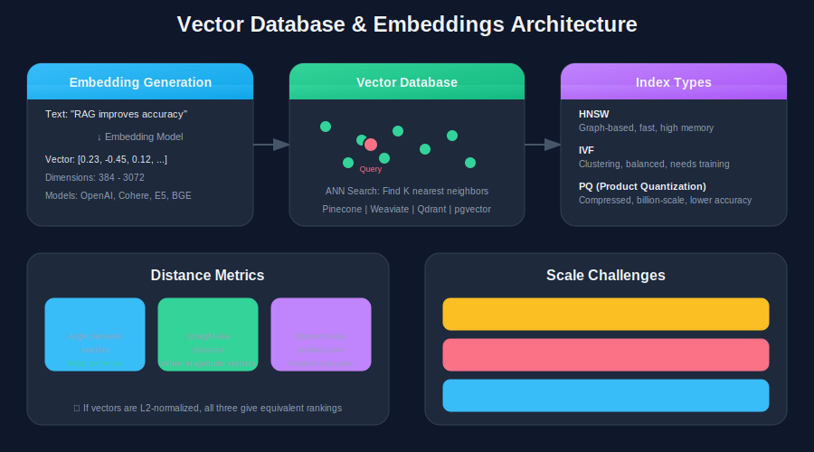

[← Back to Main](../README.md) | [← Previous: Chunking Strategies](./02-chunking-strategies.md) | [Next: Hybrid Search & Reranking →](./04-hybrid-search-reranking.md)

---

# Section 3: Embeddings & Vector Databases

> **Key Stat**: 1 billion 1024-dimensional vectors require ~4TB storage before indexing. Generating them takes 5.8+ days on a single L4 GPU.

### Fresh Level

#### Q3.1: What are embeddings and why do dimensions matter?

**Expected Answer:**

**What are embeddings:**
- Dense vector representations of text (or images, audio)
- Capture semantic meaning in numerical form
- Similar meanings = similar vectors = close in vector space

**Why dimensions matter:**

| Lower Dimensions (256-384) | Higher Dimensions (768-1536) |
|---------------------------|------------------------------|
| ✅ Faster search | ✅ More semantic nuance |
| ✅ Less storage | ✅ Better for complex queries |
| ✅ Lower compute cost | ❌ More storage |
| ❌ May lose nuance | ❌ Slower search |

**Common dimension sizes:**
- OpenAI text-embedding-3-small: 1536
- OpenAI text-embedding-3-large: 3072
- Cohere embed-v3: 1024
- Open-source (e5, bge): 384-1024

**Rule of thumb:** Start with 384-768 dimensions. Only go higher if evaluation shows benefit.

---

#### Q3.2: Explain the three main distance metrics: Cosine, Euclidean, and Dot Product.

**Expected Answer:**

**Cosine Similarity:**
- Measures angle between vectors
- Ignores magnitude (length)
- Range: -1 to 1 (1 = identical direction)
- Best for: Normalized embeddings, semantic similarity

**Euclidean Distance (L2):**
- Straight-line distance between vectors
- Considers both direction and magnitude
- Range: 0 to infinity (0 = identical)
- Best for: When magnitude matters

**Dot Product (Inner Product):**
- Sum of element-wise products
- Affected by both angle and magnitude
- Range: -∞ to +∞
- Best for: Already normalized vectors, speed

**Which to use:**
- Most embedding models: Cosine (handles unnormalized vectors)
- OpenAI embeddings: Cosine or Dot Product (they're normalized)
- Performance-critical: Dot Product (fastest to compute)

**Key insight:** If your vectors are L2-normalized, all three give equivalent rankings.

---

### Intermediate Level

#### Q3.3: Compare HNSW, IVF, and PQ indexes. When would you choose each?

**Expected Answer:**

**HNSW (Hierarchical Navigable Small World):**
- Graph-based index with multiple layers
- Very fast search, excellent recall
- Higher memory usage
- Best for: <100M vectors, low latency requirements

**IVF (Inverted File Index):**
- Clusters vectors, searches nearest clusters
- Good balance of speed and memory
- Needs training (clustering step)
- Best for: 100M-1B vectors, balanced requirements

**PQ (Product Quantization):**
- Compresses vectors by quantizing subvectors
- Significant memory savings (8-16x compression)
- Some accuracy loss
- Best for: Billion+ scale, memory constrained

**Comparison:**

| Index | Memory | Speed | Recall | Scale |
|-------|--------|-------|--------|-------|
| HNSW | High | Very Fast | Excellent | <100M |
| IVF | Medium | Fast | Good | 100M-1B |
| IVF-PQ | Low | Medium | Good | 1B+ |
| HNSW-PQ | Medium | Fast | Good | 100M-1B |

**Production reality:** Most systems use HNSW for speed, add PQ if memory becomes an issue.

---

#### Q3.4: What happens when you need to upgrade your embedding model? What are the implications?

**Expected Answer:**

**The Problem:**
- New embedding model = new vector space
- Old vectors are incompatible with new model
- Can't mix old and new in same index

**Implications:**

1. **Full Re-indexing Required**
   - Must regenerate ALL embeddings
   - For 100M documents: days of compute
   - For 1B documents: weeks of compute

2. **Downtime or Dual-Index**
   - Option A: Downtime during re-index
   - Option B: Run both indexes, migrate gradually
   - Both have cost implications

3. **Cost Impact**
   - Embedding API costs: $0.02-0.18 per million tokens
   - 1B documents × 1000 tokens avg = $20K-180K just for embeddings
   - Plus compute for self-hosted models

4. **Evaluation Regression**
   - New model may perform differently
   - Some queries may get worse
   - Need full evaluation suite re-run

**Mitigation Strategies:**
- Abstract embedding model behind interface
- Keep embedding model metadata with vectors
- Plan for periodic re-indexing in architecture
- Use versioned indexes (blue-green deployment)

**Key insight:** Embedding model selection is a long-term commitment. Choose carefully.

---

### Advanced Level

#### Q3.5: Why is multi-tenancy challenging in vector databases? How do you handle it?

**Expected Answer:**

**The Challenges:**

1. **Index Isolation**
   - Can't let Tenant A see Tenant B's data
   - Can't let Tenant A's queries search Tenant B's vectors
   - Security and privacy requirements

2. **Performance Isolation**
   - One tenant's heavy load shouldn't affect others
   - Query latency should be consistent
   - Index updates shouldn't block other tenants

3. **Scale Differences**
   - Tenant A: 1,000 documents
   - Tenant B: 10 million documents
   - Different optimization needs

**Architecture Options:**

**Option 1: Separate Collections per Tenant**
- Each tenant gets own collection/index
- Pros: Perfect isolation, simple
- Cons: Management overhead, cold start for new tenants

**Option 2: Shared Collection with Tenant ID Filter**
- All tenants in one collection
- Every vector has tenant_id metadata
- Filter by tenant_id on every query
- Pros: Simple, efficient for many small tenants
- Cons: Noisy neighbor problem, filter overhead

**Option 3: Hybrid Approach**
- Small tenants share collection with filtering
- Large tenants get dedicated collections
- Migration path as tenants grow
- Pros: Best of both worlds
- Cons: Complex management

**Recommendation for production:**
- Start with shared + filtering
- Set threshold (e.g., 1M vectors)
- Auto-migrate large tenants to dedicated
- Monitor query latency per tenant

---

#### Q3.6: How do biases in embedding models affect retrieval? How do you detect and mitigate this?

**Expected Answer:**

**How Bias Manifests:**

1. **Training Data Bias**
   - Models trained on internet data inherit its biases
   - Overrepresentation of certain topics, cultures, languages
   - "Doctor" embeds closer to "he" than "she"

2. **Retrieval Impact**
   - Biased embeddings → Biased search results
   - Some content systematically ranked lower
   - Affects fairness in information access

3. **Domain Mismatch**
   - General models struggle with specialized terminology
   - Legal, medical, Arabic content often underrepresented
   - Lower quality embeddings for minority content

**Detection Methods:**

1. **Bias Probes**
   - Test embedding similarities for known bias patterns
   - "CEO" : "man" :: "secretary" : "woman"?
   - Measure associations that shouldn't exist

2. **Retrieval Audits**
   - Run standardized query sets
   - Check if certain content types are systematically underranked
   - Compare against human relevance judgments

3. **Coverage Analysis**
   - Embed your full corpus
   - Identify clusters and outliers
   - Are some document types poorly embedded?

**Mitigation Strategies:**

1. **Model Selection**
   - Choose models trained on diverse data
   - For Arabic: Use multilingual or Arabic-specific models
   - Test on YOUR domain before committing

2. **Hybrid Search**
   - BM25 doesn't have embedding bias
   - Combine keyword + semantic search
   - Reduces impact of embedding-only bias

3. **Domain Fine-tuning**
   - Fine-tune embedding model on your data
   - Even small amounts (10K pairs) help
   - Contrastive learning on domain examples

4. **Post-hoc Reranking**
   - Reranker can correct embedding bias
   - Train reranker on domain-specific relevance

---

---

[← Previous: Chunking Strategies](./02-chunking-strategies.md) | [← Back to Main](../README.md) | [Next: Hybrid Search & Reranking →](./04-hybrid-search-reranking.md)
