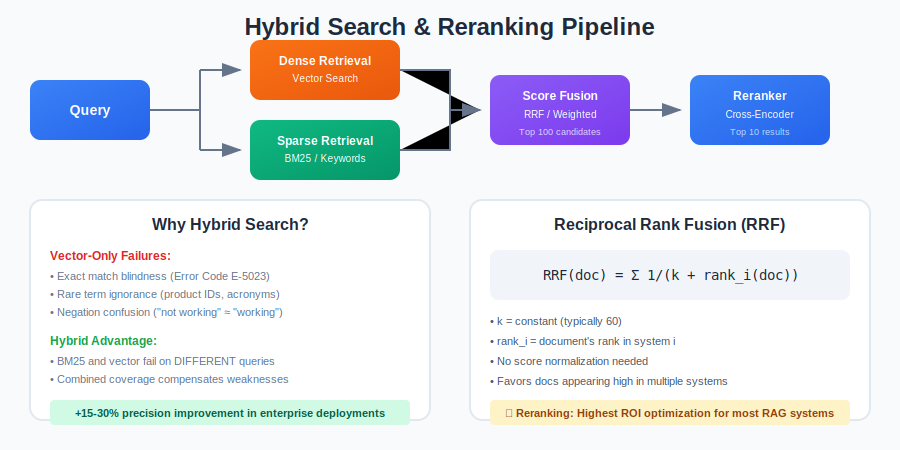

[← Back to Main](../README.md) | [← Previous: Embeddings & Vector Databases](./03-embeddings-vector-databases.md) | [Next: Semantic Caching →](./05-semantic-caching.md)

---

# Section 4: Hybrid Search & Reranking

> **Key Stat**: Hybrid search (BM25 + vector) improves precision by 15-30% over vector-only search across enterprise deployments.



### Intermediate Level

#### Q4.1: Why does pure vector search fail in production?

**Expected Answer:**

**Failure Modes of Vector-Only Search:**

1. **Exact Match Blindness**
   - User searches for "Error Code E-5023"
   - Vector search finds semantically similar errors
   - Misses the EXACT code they need

2. **Rare Term Ignorance**
   - Unique product names, IDs, acronyms
   - Not well represented in embedding space
   - BM25 handles these perfectly

3. **Negation Confusion**
   - "Not working" vs "Working"
   - Embeddings often ignore negation
   - Retrieves opposite of what's needed

4. **Length Bias**
   - Embeddings favor certain text lengths
   - Very short queries embed poorly
   - Very long documents compress too much

5. **Out-of-Distribution Queries**
   - Domain-specific jargon not in training
   - New terminology post-training cutoff
   - Embeddings are essentially random

**Evidence:** In a 2024 enterprise RAG benchmark:
- Vector only: 67% accuracy
- BM25 only: 61% accuracy
- Hybrid (vector + BM25): 82% accuracy

**Key insight:** BM25 and vector search fail on DIFFERENT queries. Combining them covers each other's weaknesses.

---

#### Q4.2: Explain Reciprocal Rank Fusion (RRF) and how to tune it.

**Expected Answer:**

**What is RRF:**
A method to combine rankings from multiple retrieval systems into a single ranked list.

**The Formula:**
```
RRF_score(doc) = Σ 1 / (k + rank_i(doc))
```
Where:
- k = constant (typically 60)
- rank_i = document's rank in system i

**Why it works:**
- Doesn't need score normalization
- Robust to different score scales
- Top-ranked documents get exponentially more weight
- Penalizes documents that appear in only one system

**Example:**
- Doc A: Rank 1 in vector, Rank 5 in BM25
- Doc B: Rank 3 in vector, Rank 2 in BM25
- With k=60:
  - RRF(A) = 1/61 + 1/65 = 0.0164 + 0.0154 = 0.0318
  - RRF(B) = 1/63 + 1/62 = 0.0159 + 0.0161 = 0.0320
- Doc B wins (appears high in both)

**Tuning Parameters:**

1. **k constant:**
   - Higher k: More equal weighting
   - Lower k: Top ranks dominate more
   - Start with k=60, tune based on evaluation

2. **Number of candidates:**
   - Retrieve top-N from each system
   - Typical: top-100 from each
   - More candidates = better recall, more compute

3. **System weights:**
   - Optional: Weight systems differently
   - If vector is more reliable: weight it higher
   - Determine through A/B testing

---

#### Q4.3: When does reranking hurt more than it helps?

**Expected Answer:**

**Reranking Costs:**
- Additional latency (100-500ms typically)
- Additional compute/API costs
- Complexity in the pipeline

**When Reranking Hurts:**

1. **Initial Retrieval is Already Poor**
   - Reranking can only reorder, not add new docs
   - If correct doc isn't in top-100, reranking won't find it
   - Garbage in → Garbage out

2. **Latency-Critical Applications**
   - Real-time autocomplete (need <50ms)
   - High-frequency queries (cost multiplies)
   - User patience is low

3. **Simple/Factoid Queries**
   - "What is the capital of France?"
   - First result is usually correct
   - Reranking adds cost without benefit

4. **Highly Curated Datasets**
   - Small, domain-specific corpus
   - Documents already highly relevant
   - Reranking may introduce noise

5. **Resource Constraints**
   - No GPU available for cross-encoder
   - API costs exceed budget
   - Simpler system preferred for maintenance

**When to Skip Reranking:**
- Retrieval evaluation shows >95% precision@10
- Latency budget is <200ms total
- Query volume is >100K/day with tight budget

**Key insight:** Reranking is high ROI when retrieval precision is 60-80%. Below 60%, fix retrieval first. Above 90%, reranking may not be needed.

---

### Advanced Level

#### Q4.4: Design a multi-stage retrieval pipeline. What goes in each stage?

**Expected Answer:**

**The Principle:**
Start fast and broad, progressively narrow and refine.

**Stage 1: Candidate Generation (Broad, Fast)**
- Goal: High recall, get ALL potentially relevant docs
- Methods: BM25, approximate nearest neighbor (ANN)
- Output: Top 500-1000 candidates
- Latency: <50ms

**Stage 2: First-Pass Ranking (Balance)**
- Goal: Remove obvious non-relevant, rough ordering
- Methods: Lightweight bi-encoder, fast cross-encoder
- Output: Top 50-100 candidates
- Latency: 50-100ms

**Stage 3: Reranking (Precise, Slow)**
- Goal: Optimal ordering of top candidates
- Methods: Heavy cross-encoder, LLM-based reranker
- Output: Top 10-20 candidates
- Latency: 100-300ms

**Stage 4: Final Selection (Domain Logic)**
- Goal: Apply business rules, diversity
- Methods: Deduplication, source diversity, recency boost
- Output: Top 3-5 for LLM context
- Latency: <10ms

**Example Configuration:**

| Stage | Method | Input | Output | Latency |
|-------|--------|-------|--------|---------|
| 1a | BM25 | Query | Top 500 | 20ms |
| 1b | HNSW vector | Query embedding | Top 500 | 30ms |
| 2 | RRF fusion + bi-encoder | 1000 candidates | Top 100 | 80ms |
| 3 | Cross-encoder | Top 100 | Top 20 | 200ms |
| 4 | Business rules | Top 20 | Top 5 | 5ms |

**Total latency: ~335ms**

---

### Intermediate Level

#### Q4.5: What is SPLADE and how does it improve sparse retrieval over BM25?

**Expected Answer:**

**BM25's Limitation:**
- BM25 only matches on exact terms present in the document
- "car" doesn't match "automobile," "vehicle," or "transport"
- This lexical gap is the primary weakness of keyword-based retrieval

**What is SPLADE:**
- SPLADE (Sparse Lexical and Expansion) is a learned sparse retrieval model
- Uses a pretrained transformer to expand both queries and documents with related terms
- Produces sparse vectors (like BM25's term-frequency vectors) but with learned term weights

**How It Works:**
1. Takes text through a transformer model (e.g., BERT/DistilBERT)
2. Outputs a ~30,000-dimensional sparse vector where each dimension corresponds to a vocabulary term
3. Non-zero values indicate the relevance/importance of that term
4. Most values are zero (sparse), making it efficient to store and search

**Key Advantage — Term Expansion:**
- If a document says "car," SPLADE may add non-zero weights for "vehicle," "automobile," "transport," "driving"
- If a query says "cheap flights," SPLADE may expand to include "affordable," "budget," "airfare"
- This bridges the vocabulary gap that defeats BM25

**Term Reduction:**
- SPLADE also removes redundant or uninformative terms
- Common words get their weights reduced
- Produces cleaner, more discriminative sparse representations

**Comparison with BM25:**

| Aspect | BM25 | SPLADE |
|--------|------|--------|
| Term matching | Exact only | Exact + expanded |
| Training | None (statistical) | Requires training data |
| Inference | CPU-only | Requires GPU |
| Interpretability | High | High (still sparse terms) |
| Performance | Good baseline | Significantly better on most benchmarks |

**In Hybrid Search:**
- SPLADE can replace BM25 as the sparse component in hybrid retrieval
- BM25 + dense is a good combination; SPLADE + dense is often better
- Recent research (IBM, 2025): three-way retrieval (BM25 + dense + sparse/SPLADE) is the optimal combination for RAG

**Trade-offs:**
- SPLADE requires GPU inference (unlike BM25 which is CPU-only), making it more expensive to run
- Requires training or a pretrained SPLADE model
- Adds latency compared to BM25 (~20-50ms vs ~5-10ms for BM25)

**Key insight:** SPLADE bridges the gap between keyword and semantic search. Consider it when BM25's exact-match limitation hurts your retrieval quality, but you still want the interpretability and efficiency of sparse retrieval.

---

### Advanced Level

#### Q4.6: Compare bi-encoders vs cross-encoders for reranking. What are the trade-offs?

**Expected Answer:**

**Bi-Encoders:**
- Encode query and document independently into separate embeddings
- Compare via cosine similarity or dot product
- Embeddings can be pre-computed for documents
- Fast at inference: only need to embed the query, then compare against stored embeddings

**Cross-Encoders:**
- Encode query AND document together as a single input (concatenated)
- Output a single relevance score (not an embedding)
- Cannot pre-compute: must run the model for each query-document pair
- Much more accurate because the model sees the full interaction between query and document terms

**Why Cross-Encoders Are More Accurate:**
- They see token-level interactions between query and document
- Can detect nuanced relevance that independent encoding misses
- Example: query "Python error handling best practices" and a document about "Java exception handling" — a bi-encoder might score this high (similar topics), but a cross-encoder can see the language mismatch

**Speed Comparison:**

| Operation | Bi-Encoder | Cross-Encoder |
|-----------|-----------|---------------|
| Score 10,000 documents | ~10ms (pre-computed) | ~20 seconds |
| Score 100 documents | ~10ms (pre-computed) | ~200ms |
| Score 20 documents | ~10ms (pre-computed) | ~40ms |
| Can pre-compute docs? | Yes | No |

**Production Pattern: Two-Stage Pipeline**
1. **Stage 1 — Bi-encoder (retrieval):** embed the query, find top 100-500 candidates via ANN search. Fast because document embeddings are pre-computed.
2. **Stage 2 — Cross-encoder (reranking):** score each of the top 20-100 candidates with the cross-encoder. Slow per-pair, but only applied to a small set.

**ColBERT — The Middle Ground:**
- Late interaction model: encodes query and document independently (like bi-encoder)
- But preserves token-level embeddings (not compressed to single vector)
- Compares at token level using MaxSim operation (richer than cosine)
- Faster than cross-encoder (can partially pre-compute), more accurate than bi-encoder

| Model Type | Speed | Accuracy | Pre-compute? |
|-----------|-------|----------|-------------|
| Bi-encoder | Very fast | Good | Yes (full) |
| ColBERT | Fast | Very good | Yes (partial) |
| Cross-encoder | Slow | Excellent | No |

**Model Options:**
- **Cross-encoder rerankers:** Cohere Rerank, BGE reranker, ms-marco-MiniLM-L-12-v2
- **ColBERT:** ColBERTv2, PLAID (efficient ColBERT implementation)
- **Bi-encoder:** Same as embedding models (e5, bge, OpenAI, etc.)

**Key insight:** The bi-encoder to cross-encoder pipeline is the standard production pattern. Don't use cross-encoders as your first-stage retriever — they're too slow. Don't skip reranking if your retrieval precision needs improvement — cross-encoders provide a significant accuracy boost on the short list.

---

---

[← Previous: Embeddings & Vector Databases](./03-embeddings-vector-databases.md) | [← Back to Main](../README.md) | [Next: Semantic Caching →](./05-semantic-caching.md)
