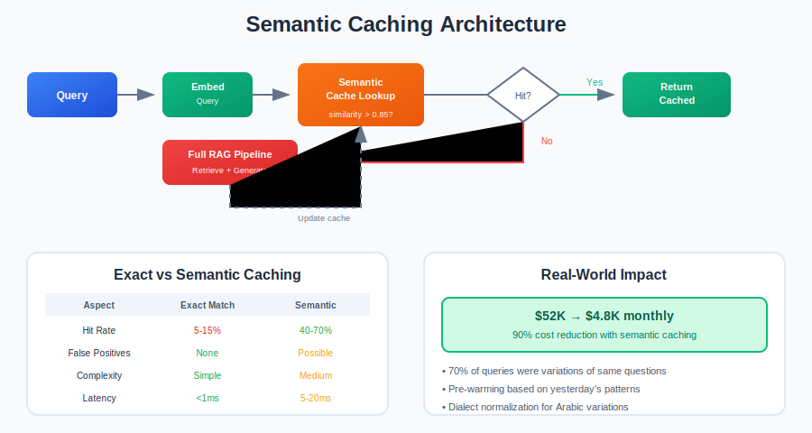

[← Back to Main](../README.md) | [← Previous: Hybrid Search & Reranking](./04-hybrid-search-reranking.md) | [Next: Multi-Agent Systems →](./06-multi-agent-systems.md)

---

# Section 5: Semantic Caching

> **Key Stat**: Semantic caching can reduce LLM costs by 50-70% and improve latency by 60% for repetitive query patterns.



### Intermediate Level

#### Q5.1: What's the difference between exact-match caching and semantic caching?

**Expected Answer:**

**Exact-Match Caching:**
- Cache key = exact query string
- "What is RAG?" hits cache
- "What's RAG?" misses cache (different string)
- Simple to implement
- Low hit rate for natural language

**Semantic Caching:**
- Cache key = query embedding
- Find similar cached queries by vector similarity
- "What is RAG?" and "Explain RAG" may share cache
- Higher hit rate
- More complex implementation

**Comparison:**

| Aspect | Exact-Match | Semantic |
|--------|-------------|----------|
| Implementation | Simple hash lookup | Vector similarity search |
| Hit rate | Low (5-15%) | High (40-70%) |
| False positives | None | Possible |
| Storage | Query → Response | Query + Embedding → Response |
| Latency overhead | Negligible | 5-20ms for similarity search |

**When to use which:**
- Exact-match: API responses, deterministic queries
- Semantic: Natural language, chatbots, search queries
- Both: Exact-match first, then semantic if miss

---

#### Q5.2: How do you choose the right similarity threshold for semantic cache?

**Expected Answer:**

**The Trade-off:**
- High threshold (0.95+): Few hits, high accuracy
- Low threshold (0.80): Many hits, risk of wrong answers

**Factors Affecting Threshold:**

1. **Risk Tolerance**
   - Customer support: Can afford some errors → 0.85
   - Medical/Legal: Must be accurate → 0.95+
   - Internal tools: Moderate → 0.90

2. **Query Diversity**
   - Similar queries only: Lower threshold OK
   - Diverse queries: Need higher threshold

3. **Answer Sensitivity**
   - Generic answers: Lower threshold OK
   - Specific answers: Higher threshold needed

**How to Determine Threshold:**

1. **Collect Query Pairs**
   - Get 1000+ query pairs from logs
   - Label: "Same intent" or "Different intent"

2. **Compute Similarities**
   - Embed all queries
   - Calculate pairwise similarities

3. **Find Optimal Threshold**
   - Plot precision/recall at different thresholds
   - Choose threshold that maximizes F1
   - Or: Set minimum precision, maximize recall

**Typical Ranges:**
- Conservative: 0.92-0.95
- Balanced: 0.88-0.92
- Aggressive: 0.82-0.88

**Key insight:** Start conservative (0.92), monitor false positives, lower gradually.

---

### Advanced Level

#### Q5.3: How would you implement semantic caching for a system with dialect variations (e.g., Arabic)?

**Expected Answer:**

**The Challenge:**
- "إجازة رمضان" vs "عطلة الصيام" = Same intent
- Saudi vs Egyptian phrasing differs
- Standard similarity may not capture this

**Architecture: Semantic Clustering Cache**

**Component 1: Dialect Normalizer**
- Pre-process queries before caching
- Map dialect variations to canonical form
- Use lightweight dialect detection model
- Normalize common variations

**Component 2: Query Embedding**
- Use Arabic-optimized embedding model
- Options: AraBERT, CAMeLBERT, multilingual-e5
- May need domain fine-tuning

**Component 3: Cluster Management**
- Group similar queries into clusters
- Store cluster centroid as cache key
- New query → Find nearest cluster

**Component 4: Cache Logic**
```
1. Normalize query (dialect → standard)
2. Embed normalized query
3. Find nearest cluster centroid
4. If similarity > threshold:
   - Return cached response
5. Else:
   - Execute full pipeline
   - Update/create cluster
```

**Optimization: Pre-warming**
- Analyze yesterday's query patterns
- Pre-generate embeddings for likely queries
- Especially for predictable spikes (prayer times, Ramadan)

**Results from MENA deployment:**
- 94% cache hit rate during peak
- 70% GPU reduction
- <2s response time (from 8s)

---

#### Q5.4: How do you handle cache invalidation when source documents change?

**Expected Answer:**

**The Problem:**
Cached answers become stale when underlying data changes.

**Invalidation Strategies:**

**1. Time-Based Expiration (TTL)**
- Set maximum cache lifetime
- Simple but wasteful (valid caches expire too)
- Good for: Frequently changing data

**2. Document-Triggered Invalidation**
- Track which documents each cached answer used
- When document updates → Invalidate related caches
- Requires: Document → Cache mapping

**3. Selective Invalidation**
- Not all document changes matter
- Track specific entities/facts in cache
- Only invalidate if relevant facts changed
- Requires: Entity extraction from answers

**4. Versioned Caching**
- Include document version in cache key
- New version = automatic cache miss
- Simple but increases storage

**Implementation Approach:**

**For RAG systems:**
```
Cache entry:
- Query embedding
- Response
- Document IDs used
- Document versions used
- Timestamp

Invalidation:
- Document update triggers
- Find caches using that document
- Mark as invalid or delete
```

**Hybrid Strategy (Recommended):**
- TTL: 24 hours maximum
- Document-triggered: Immediate for changed docs
- Soft expiration: Serve stale + async refresh

**Key insight:** Perfect invalidation is often not worth the complexity. Bounded staleness (TTL) with critical-path invalidation covers 95% of needs.

---

### Intermediate Level

#### Q5.5: What are the risks of semantic caching? When can it go wrong?

**Expected Answer:**

**Risk 1: False Positives (Most Dangerous)**
- Cache returns a wrong answer for a similar-but-different query
- Example: "What's the refund policy for Product A?" returns cached answer for "What's the refund policy for Product B?"
- The queries are semantically very similar but require completely different answers
- Impact: users receive incorrect information, potentially causing real harm

**Risk 2: Stale Responses**
- Cached answer was correct when cached but underlying data has changed
- Example: "What are the office hours?" returns last month's schedule after hours changed
- Especially dangerous for time-sensitive information (prices, availability, policies)

**Risk 3: Context Sensitivity**
- Same question in different contexts should get different answers
- "What's my account balance?" for different users must return different results
- "What's our refund policy?" may differ by region, product, or customer tier
- Semantic similarity between queries is high, but the required response is different

**Risk 4: Threshold Sensitivity**
- Small threshold changes can dramatically affect both hit rate AND error rate
- At 0.90 threshold: 40% hit rate, 0.2% false-positive rate
- At 0.85 threshold: 60% hit rate, 2.5% false-positive rate
- A 5-point threshold change can increase errors by 10x

**Risk 5: Privacy Leakage**
- User A's cached query/response might be served to User B if not properly isolated
- Particularly dangerous for personal, financial, or health-related queries
- Even anonymized queries can leak information through cached responses

**Mitigation Strategies:**

| Risk | Mitigation |
|------|-----------|
| False positives | Per-entity cache keys (include product/topic in key) |
| Stale responses | TTL + document-triggered invalidation |
| Context sensitivity | Per-user or per-session cache isolation |
| Threshold sensitivity | Start conservative (0.92+), lower gradually with monitoring |
| Privacy leakage | Strict tenant/user isolation, never share caches across users |

**Additional Mitigations:**
- Combine exact-match + semantic caching (exact-match first — it's always safe)
- Monitor false-positive rate continuously using user feedback signals
- Implement cache bypass for sensitive query categories (medical, legal, financial)
- Log cache hits with similarity scores for post-hoc auditing

**Key insight:** Semantic caching trades accuracy for speed and cost. The risk of a false positive (wrong cached answer) must be weighed against the benefit. For medical/legal applications, use very high thresholds or skip semantic caching entirely.

---

### Expert Level

#### Q5.6: Design a cache warming strategy for a government service expecting a traffic spike during Ramadan.

**Expected Answer:**

**Context:**
- Government service in MENA region (e.g., citizen services portal)
- Normal traffic: ~50K daily users
- Ramadan traffic: ~200K daily users (4x spike)
- Predictable timing: Ramadan dates known months in advance
- Query patterns: prayer times, service availability, holiday schedules, regulation questions

**Phase 1: Analysis (4-6 weeks before Ramadan)**

1. **Study Last Year's Ramadan Query Logs**
   - Identify top 100 queries by frequency
   - Categorize by topic: prayer times, service hours, holiday regulations, benefits, permits
   - Identify daily patterns (queries spike after Iftar, before Fajr)

2. **Identify Query Clusters**
   - Group semantically similar queries
   - Map dialect variations to canonical queries
   - Estimate coverage: top 100 clusters typically cover 60-70% of traffic

**Phase 2: Pre-Warming (1-2 weeks before Ramadan)**

1. **Generate Responses for Top Queries**
   - Run top 100-200 query clusters through the full RAG pipeline
   - Verify response quality with human review
   - Store as high-confidence cache entries

2. **Pre-Compute Embeddings for Likely Queries**
   - Generate embeddings for all known query variations
   - Include dialect variations (Saudi, Egyptian, Gulf, Levantine phrasing)
   - Example: "prayer times" in MSA, Saudi dialect, Egyptian dialect all pre-embedded

3. **Load Cache with Verified Entries**
   - Pre-populate Redis/cache layer with verified Q&A pairs
   - Set appropriate TTL per category (prayer times: 12hr, regulations: 7 days)

**Phase 3: Dynamic Warming (During Ramadan)**

1. **Real-Time Trend Detection**
   - Analyze trending queries every hour
   - Detect emerging patterns not in historical data
   - Pro-actively cache responses for new trending queries

2. **Adaptive TTL Management**
   - Prayer times: refresh every 12 hours (times change daily)
   - Service hours: refresh weekly or on change
   - Regulations: longer TTL (stable information)
   - Breaking announcements: immediate cache, short TTL

**Phase 4: Dialect Handling**

- Pre-warm with variations across major Arabic dialects
- Saudi: specific government terminology and phrasing
- Egyptian: common alternative phrasings
- Gulf: regional variations
- Levantine: additional variations for expatriate users
- Use dialect-aware embedding model for cache matching

**Phase 5: Capacity Planning**

- Size Redis cluster for 200K users at peak
- Estimate: 70% cache hit rate target = 140K cached responses per day
- Storage: ~500 bytes per cache entry x 50K unique entries = ~25MB (trivial)
- Compute: size for 60K cache misses per day at peak (LLM backend)
- Auto-scaling: configure LLM backend to scale from 2 to 8 instances

**Fallback Strategy:**
- If cache misses spike unexpectedly, auto-scale LLM backend
- Serve slightly stale responses during extreme peaks (better than timeouts)
- Queue non-urgent queries during peak hours
- Static fallback pages for most common queries if system overloads

**Expected Results (Based on Similar MENA Deployments):**
- 94% cache hit rate during peak hours
- 70% GPU cost reduction compared to uncached
- <2s response time (down from 8s without caching)
- Smooth handling of 4x traffic spike without degradation

**Key insight:** Predictable traffic spikes are a gift — use historical data to pre-warm caches and handle peaks gracefully. The combination of pre-warming, dialect awareness, and dynamic adaptation turns a potential system failure into a smooth user experience.

---

---

[← Previous: Hybrid Search & Reranking](./04-hybrid-search-reranking.md) | [← Back to Main](../README.md) | [Next: Multi-Agent Systems →](./06-multi-agent-systems.md)
